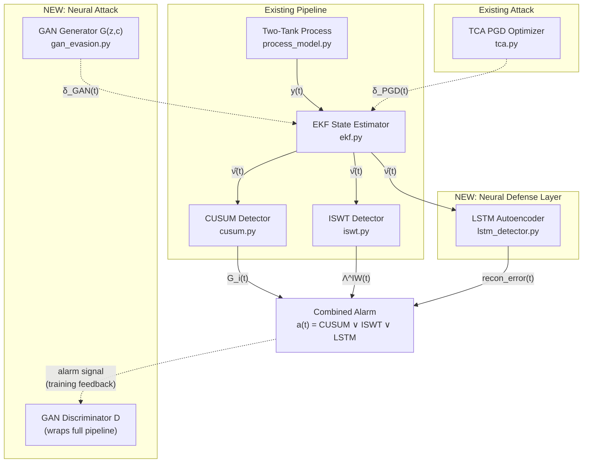
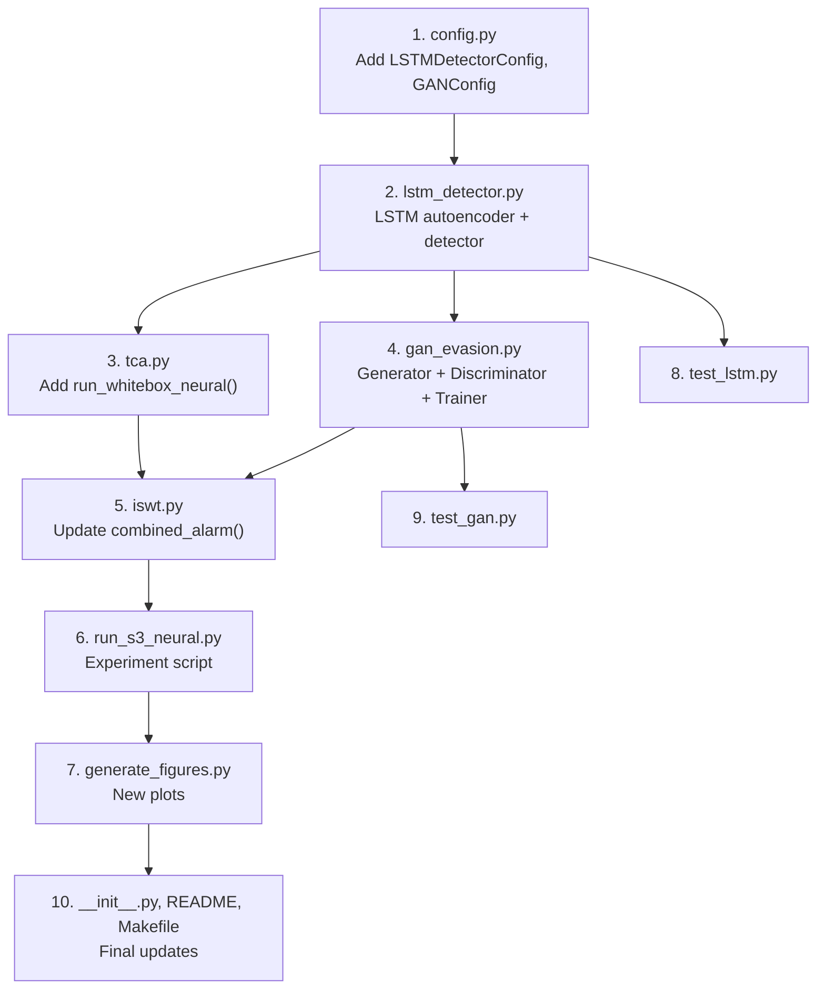

# From Optimization to Generation: Adversarial AI Attacks on Neural Digital Twin Defenses

## Background & Motivation

The current project demonstrates that the **Innovation Whiteness Detector (IWD)** catches Targeted Consistency Attacks (TCA) by exploiting unavoidable cross-sensor correlations. The attacker uses **PGD-based optimization** (per-session, per-budget) to evade CUSUM + ISWT.

This expansion introduces two intertwined AI contributions:

1. **A neural defense layer** — an LSTM autoencoder trained on the EKF innovation sequence — added alongside CUSUM + ISWT. This represents the real-world trend of deploying ML-based anomaly detectors in industrial settings.

2. **A neural attack layer** — a conditional GAN generator that *learns* to produce stealthy perturbations, replacing per-session PGD with a single forward pass. This represents a much more dangerous, scalable threat model.

The academic narrative follows a **red-team escalation arc**:

> *Statistical defense (CUSUM) → Statistical + physics-based defense (+ ISWT) → Statistical + physics-based + AI defense (+ LSTM) → AI-powered attack (GAN) overcomes the combined pipeline?*

The central research question becomes: **Can a learned generative attacker defeat a learned neural defender, and does the physics-based IWD remain the last line of defense?**

---

## User Review Required

> [!IMPORTANT]
> **Academic scope**: This plan adds a new S3 experiment set (alongside existing S1/S2). The LSTM and GAN are both lightweight by design (trainable on CPU in minutes, not hours). This keeps the project reproducible for reviewers without GPU requirements.

> [!WARNING]
> **Paper restructuring**: This expansion would require significant additions to the paper (new Section 5 for LSTM defense, new Section 6 for GAN attack, ~3 new tables, ~4 new figures). Does this fit within your course requirements, or should I scope it down to just one of the two (LSTM or GAN)?

## Open Questions

1. **Training data volume**: The LSTM will be trained on clean-operation innovation sequences from the calibration phase (1800 steps at 1 Hz = 30 min). Is this enough for your academic purposes, or should we extend the calibration window to generate more training data (e.g., 3600 steps)?

2. **GPU dependency**: The plan uses CPU-only PyTorch (already in your `requirements.txt`). The LSTM and GAN are small enough for CPU training. Is this acceptable, or do you have GPU access and want larger models?

3. **SWaT integration**: Should the LSTM + GAN experiments also run on the SWaT dataset (S2), or only on the Two-Tank model (S1)?

---

## Proposed Changes

### Overview Architecture



---

### Component 1: Core Configuration

#### [MODIFY] [config.py](file:///c:/Users/enzoh/Documents/UQAC/Projets%20Hugo/adversarial-dt/core/config.py)

Add two new configuration dataclasses:

```python
@dataclass
class LSTMDetectorConfig:
    """LSTM autoencoder anomaly detector parameters."""
    hidden_dim: int = 32          # LSTM hidden state dimension
    n_layers: int = 2             # Number of stacked LSTM layers
    seq_len: int = 50             # Input sequence length (lookback window)
    latent_dim: int = 16          # Bottleneck dimension
    threshold_percentile: float = 99.0  # Anomaly threshold from training data
    learning_rate: float = 1e-3
    n_epochs: int = 100
    batch_size: int = 32
    dropout: float = 0.1

@dataclass
class GANConfig:
    """Conditional GAN evasion generator parameters."""
    latent_dim: int = 32          # Generator noise input dimension
    hidden_dim: int = 64          # Hidden layer dimension
    n_layers: int = 3             # Generator/discriminator depth
    seq_len: int = 50             # Generated sequence length (matches LSTM)
    learning_rate_g: float = 2e-4 # Generator learning rate
    learning_rate_d: float = 2e-4 # Discriminator learning rate
    n_epochs: int = 200           # Training epochs
    batch_size: int = 32
    lambda_physics: float = 10.0  # Weight for physics-consistency loss
    lambda_budget: float = 5.0    # Weight for ε-budget constraint loss
```

Add these to `ExperimentConfig`:
```python
lstm: LSTMDetectorConfig = field(default_factory=LSTMDetectorConfig)
gan: GANConfig = field(default_factory=GANConfig)
```

---

### Component 2: LSTM Autoencoder Anomaly Detector

#### [NEW] [lstm_detector.py](file:///c:/Users/enzoh/Documents/UQAC/Projets%20Hugo/adversarial-dt/core/lstm_detector.py)

**Purpose**: Adds an AI-based anomaly detector that operates on the same standardized innovation sequences (`ν̂(t)`) as CUSUM and ISWT.

**Architecture**: Encoder-decoder LSTM autoencoder.
- **Encoder**: `LSTM(N, hidden_dim, n_layers)` → compresses `seq_len` innovation vectors into a latent representation
- **Decoder**: `LSTM(latent_dim, hidden_dim, n_layers)` → reconstructs the original innovation sequence
- **Anomaly score**: Mean squared reconstruction error per window. When `recon_error > threshold`, an alarm is raised.

**Key design decisions**:
- The LSTM sees **standardized innovations** (not raw sensors), which are zero-mean unit-variance under H₀. This makes training data-efficient.
- The threshold is set as the 99th percentile of reconstruction error on clean training data (matching the ISWT's α = 0.05 philosophy).
- A differentiable `forward()` method enables gradient-based adversarial attacks.

**Classes/functions**:
```
class LSTMAutoencoder(nn.Module):
    - __init__(n_sensors, config)
    - forward(x) → reconstructed, latent
    - compute_anomaly_score(x) → recon_error

class LSTMDetector:
    - __init__(n_sensors, config)
    - train(clean_innovations)     # Train on calibration data
    - update(std_innovation)       # Online, sliding window
    - run_batch(std_innovations)   # Offline batch
    - get_model() → nn.Module      # For adversarial gradient access

def lstm_anomaly_torch(model, std_innovations):
    # Differentiable anomaly score for TCA/GAN training
```

---

### Component 3: Adversarial Attacks on the LSTM

#### [MODIFY] [tca.py](file:///c:/Users/enzoh/Documents/UQAC/Projets%20Hugo/adversarial-dt/core/tca.py)

**Add `run_whitebox_neural()` method** to the `TargetedConsistencyAttack` class. This extends the PGD attack to also evade the LSTM detector.

**Key change**: The surrogate loss function becomes a weighted sum of three components:

```
L_surrogate = -(cusum_penalty + λ_iswt · iswt_penalty + λ_lstm · lstm_penalty)
```

where:
- `lstm_penalty = mean(recon_error) / threshold` — keeps LSTM reconstruction error below alarm threshold
- The gradient `∇_δ L` now flows through **both** the differentiable EKF and the LSTM

**New method signature**:
```python
def run_whitebox_neural(self, Y, U, attacked_idx, compromised_idx,
                        epsilon, lstm_model, lstm_config,
                        iswt_weight=2.0, lstm_weight=1.0,
                        verbose=False) -> dict:
```

This lets the experiment compare:
- `run_whitebox()` — PGD evading CUSUM + ISWT only (existing)
- `run_whitebox_neural()` — PGD evading CUSUM + ISWT + LSTM (new)

---

### Component 4: GAN Evasion Generator

#### [NEW] [gan_evasion.py](file:///c:/Users/enzoh/Documents/UQAC/Projets%20Hugo/adversarial-dt/core/gan_evasion.py)

**Purpose**: Train a conditional generator that produces stealthy perturbations δ(t) in a single forward pass, replacing iterative PGD.

**Generator `G(z, c)`**:
- Input: latent noise `z ∈ R^latent_dim` + conditioning vector `c = [ε, fault_type, operating_point]`
- Output: perturbation sequence `δ ∈ R^(seq_len × N)` within the ε-budget
- Architecture: MLP → LSTM → Linear → `tanh` × ε (ensures L∞ budget by construction)

**Discriminator `D(ν̂)`**:
- Wraps the full detection pipeline (EKF → CUSUM → ISWT → LSTM) as a differentiable function
- Input: perturbed innovation sequence
- Output: probability that the input is "clean" (no attack)
- This is **not** a classic image GAN discriminator — it's a *physics-informed* discriminator that uses the actual detection statistics

**Training loop**:
```
for each epoch:
    1. Sample z, c (random noise + random operating conditions)
    2. G produces δ = G(z, c)
    3. Apply δ to faulted measurements: Y_attacked = Y_faulted + δ
    4. Run differentiable pipeline: EKF → CUSUM → ISWT → LSTM
    5. Compute combined alarm probability (soft version)
    6. Generator loss: L_G = -log(1 - p_alarm) + λ_physics · L_physics + λ_budget · L_budget
       where:
         - L_physics = ||δ||_∞ penalty (redundant with tanh, but regularizes)
         - L_budget = constraint that perturbation is physically plausible
    7. Discriminator loss: standard binary cross-entropy
    8. Backpropagate through the entire differentiable pipeline
```

**Key academic insight**: The GAN training essentially performs **adversarial training** from the attacker's perspective. If the generator converges, it has found a *distribution* of stealthy perturbations, not just a single point solution like PGD.

**Classes/functions**:
```
class EvasionGenerator(nn.Module):
    - __init__(n_sensors, config)
    - forward(z, conditioning) → delta  # δ ∈ [-ε, ε]^(seq_len × N)

class PipelineDiscriminator(nn.Module):
    - __init__(diff_ekf, cusum_cfg, iswt_cfg, lstm_model)
    - forward(Y, U, delta) → alarm_probability

class GANTrainer:
    - __init__(generator, discriminator, config)
    - train(train_data) → training_history
    - generate_perturbation(fault_config) → delta  # Single forward pass

def train_evasion_gan(sys_config, ekf_config, cusum_config, iswt_config,
                       lstm_model, gan_config, train_data) -> GANTrainer:
    # End-to-end training function
```

---

### Component 5: Combined Alarm Decision

#### [MODIFY] [iswt.py](file:///c:/Users/enzoh/Documents/UQAC/Projets%20Hugo/adversarial-dt/core/iswt.py)

Update the `combined_alarm()` function to include the LSTM detector:

```python
def combined_alarm_full(cusum_alarm, iswt_alarm, lstm_alarm=False):
    """Extended combined alarm: CUSUM ∨ ISWT ∨ LSTM."""
    return bool(np.any(cusum_alarm) or iswt_alarm or lstm_alarm)
```

---

### Component 6: New Experiment Script

#### [NEW] [run_s3_neural.py](file:///c:/Users/enzoh/Documents/UQAC/Projets%20Hugo/adversarial-dt/experiments/run_s3_neural.py)

**Purpose**: The main experiment script that produces all new tables and figures.

**Experiment protocol (3 phases)**:

**Phase A — LSTM Training & Baseline** (Table 6):
1. Run calibration → get clean innovations (reuse `full_calibration()`)
2. Train LSTM autoencoder on clean innovations
3. Validate LSTM on clean data (FPR), attacked data without TCA (TPR)
4. Compare detection performance: CUSUM-only vs. ISWT-only vs. LSTM-only vs. Full pipeline

**Phase B — Adversarial PGD Attack on LSTM** (Table 7):
1. For each fault magnitude × budget level:
   - Run `run_whitebox()` (existing TCA, evades CUSUM + ISWT only)
   - Run `run_whitebox_neural()` (new TCA, evades CUSUM + ISWT + LSTM)
2. Measure: evasion rate, SDS, LSTM reconstruction error
3. Key question: *Does adding the LSTM to the objective make the attack harder or easier?*

**Phase C — GAN vs. PGD Comparison** (Table 8, Figures):
1. Train GAN generator on diverse operating conditions
2. For each fault magnitude × budget level:
   - Generate perturbations with GAN (single forward pass)
   - Generate perturbations with PGD (100 iterations)
3. Compare: evasion rate, SDS, computational cost (wall-clock time)
4. Key question: *Can the GAN match or exceed PGD evasion with O(1) cost?*

**Output tables/figures**:

| Output | Description |
|---|---|
| **Table 6** | Detection comparison: CUSUM vs. ISWT vs. LSTM vs. Combined (TPR/FPR) |
| **Table 7** | PGD evasion rate with/without LSTM in the defense pipeline |
| **Table 8** | GAN vs. PGD: evasion rate, SDS, inference time |
| **Figure: LSTM ROC** | ROC curve of LSTM detector on clean vs. attacked data |
| **Figure: GAN vs PGD convergence** | GAN training loss + generated SDS over epochs |
| **Figure: Evasion heatmap** | Budget (ε/σ) × Fault magnitude → evasion success rate, for each attack method |
| **Figure: Innovation covariance (GAN)** | Cross-sensor correlation heatmap for GAN-generated perturbations (compare with existing TCA heatmap) |

---

### Component 7: Figure Generation

#### [MODIFY] [generate_figures.py](file:///c:/Users/enzoh/Documents/UQAC/Projets%20Hugo/adversarial-dt/experiments/generate_figures.py)

Add functions for:
- `plot_lstm_roc()` — ROC curve of the LSTM detector
- `plot_gan_vs_pgd()` — Evasion comparison across budgets
- `plot_gan_training()` — GAN training dynamics (generator loss, discriminator accuracy, SDS)
- `plot_evasion_heatmap()` — 2D heatmap (budget × fault magnitude → evasion rate)
- `plot_gan_innovation_covariance()` — Cross-sensor correlation fingerprint of GAN perturbations

---

### Component 8: Updated Module Exports and Dependencies

#### [MODIFY] [__init__.py](file:///c:/Users/enzoh/Documents/UQAC/Projets%20Hugo/adversarial-dt/core/__init__.py)

Add new exports:
```python
from .lstm_detector import LSTMAutoencoder, LSTMDetector
from .gan_evasion import EvasionGenerator, GANTrainer
```

#### [MODIFY] [requirements.txt](file:///c:/Users/enzoh/Documents/UQAC/Projets%20Hugo/adversarial-dt/requirements.txt)

No new dependencies needed — `torch>=2.0` is already present and sufficient for LSTM + GAN.

---

### Component 9: Tests

#### [NEW] [test_lstm.py](file:///c:/Users/enzoh/Documents/UQAC/Projets%20Hugo/adversarial-dt/tests/test_lstm.py)

- `test_lstm_output_shape` — verify autoencoder I/O dimensions
- `test_lstm_trains_on_clean_data` — verify loss decreases over epochs
- `test_lstm_detects_anomaly` — verify recon error increases under attack
- `test_lstm_differentiable` — verify gradients flow through the model

#### [NEW] [test_gan.py](file:///c:/Users/enzoh/Documents/UQAC/Projets%20Hugo/adversarial-dt/tests/test_gan.py)

- `test_generator_output_shape` — verify δ has correct dimensions
- `test_generator_budget_constraint` — verify |δ_i| ≤ ε_i ∀i,t
- `test_discriminator_output_range` — verify output ∈ [0, 1]
- `test_gan_training_loop` — verify one training step runs without errors

---

### Component 10: README Update

#### [MODIFY] [README.md](file:///c:/Users/enzoh/Documents/UQAC/Projets%20Hugo/adversarial-dt/README.md)

Add new section:

```markdown
### 5. Neural Attack/Defense (`core/lstm_detector.py`, `core/gan_evasion.py`)
AI-powered extensions to the framework:
- **LSTM Autoencoder**: Neural anomaly detector trained on EKF innovations
- **GAN Evasion Generator**: Conditional generator that produces stealthy 
  perturbations in a single forward pass (no iterative optimization)
- Run with `make run-s3` or `python experiments/run_s3_neural.py`
```

#### [MODIFY] [Makefile](file:///c:/Users/enzoh/Documents/UQAC/Projets%20Hugo/adversarial-dt/Makefile)

Add `run-s3` target:
```makefile
run-s3:
	python experiments/run_s3_neural.py
```

---

## Execution Order



## Verification Plan

### Automated Tests
```bash
# Unit tests for new components
make test
# Or individually:
pytest tests/test_lstm.py -v
pytest tests/test_gan.py -v

# Existing tests should still pass (no breaking changes)
pytest tests/ -v
```

### Functional Verification
```bash
# Run the full S3 experiment (CPU, ~10-20 minutes)
make run-s3

# Verify output files exist
ls results/s3/
# Expected: table6_detection.json, table7_adversarial_lstm.json, 
#           table8_gan_vs_pgd.json

# Generate figures
python experiments/generate_figures.py
ls results/figures/
# Expected: lstm_roc.pdf, gan_vs_pgd.pdf, gan_training.pdf, 
#           evasion_heatmap.pdf, gan_innovation_covariance.pdf
```

### Key Success Criteria
1. **LSTM detects attacks**: TPR > 90% on unperturbed fault data
2. **PGD degrades with LSTM**: Evasion rate drops when LSTM is added to the defense
3. **GAN matches PGD**: GAN evasion rate is within 10% of PGD across budgets
4. **GAN is faster**: GAN inference time < PGD optimization time by ≥ 10×
5. **IWD remains robust**: Even with GAN attacks, ISWT still catches the cross-sensor correlations (the physics-based "last line of defense" narrative holds)
